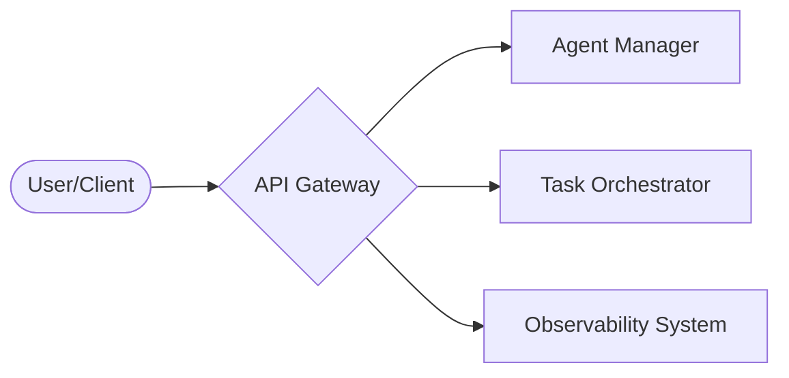
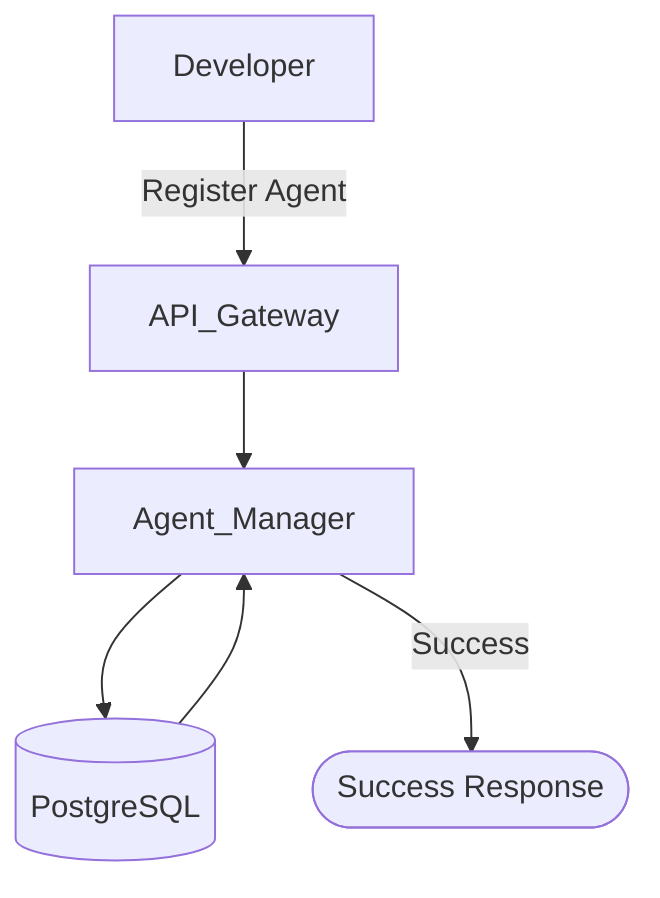
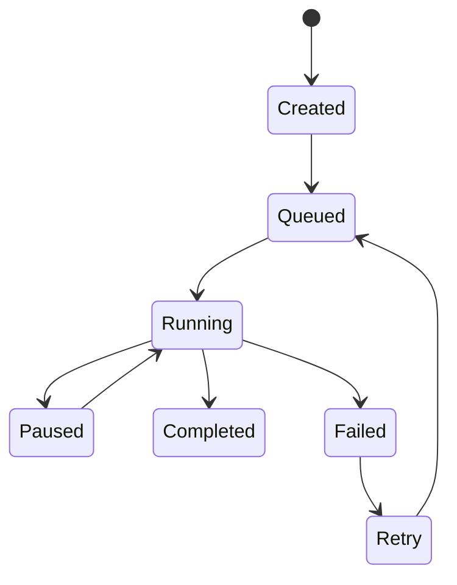
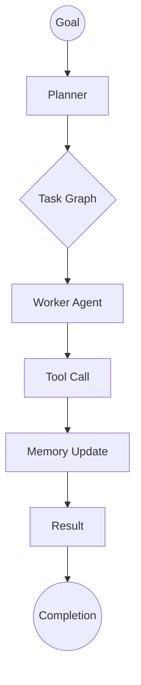
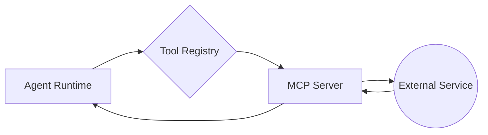
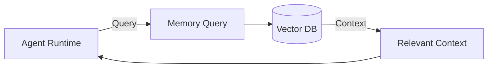
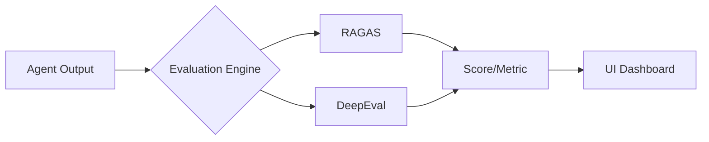
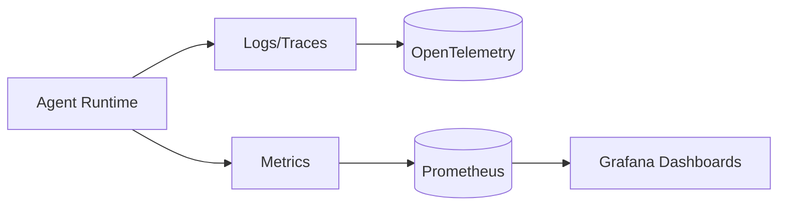
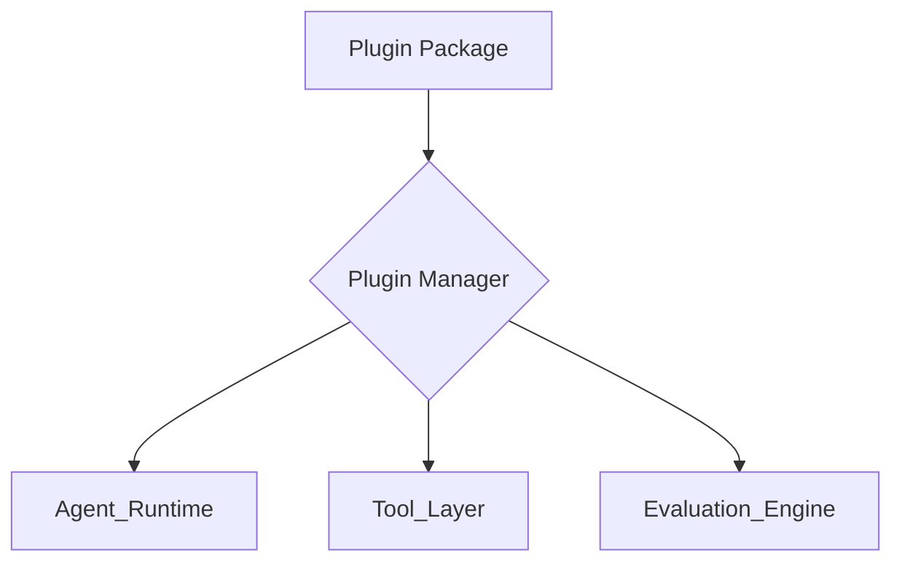
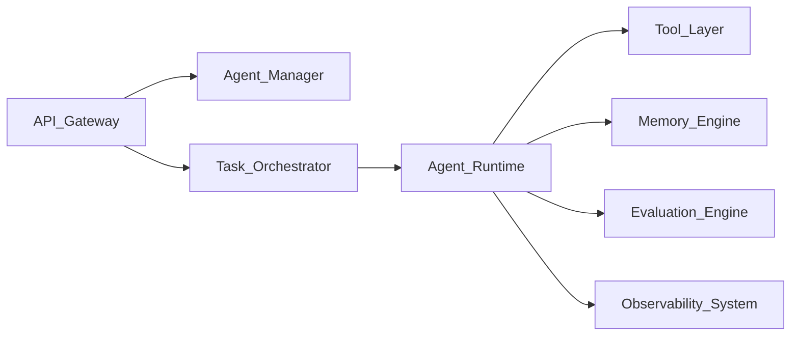

# AgentOS: Component Design Document (CDD)

**Version:** 1.0  
**Project:** AgentOS  
**Status:** Implementation Blueprint  

---

## 1. Introduction

The **Component Design Document (CDD)** defines the internal structure and behavior of each core module within AgentOS. While the *System Architecture Specification* describes the high-level vision, the CDD serves as the low-level engineering blueprint for implementation.

### Goals
- Define clear responsibilities for each component.
- Standardize APIs and communication interfaces.
- Outline internal workflows and data flows.
- Map dependencies between system modules.
- Provide concrete implementation guidance for developers.

---

## 2. Core Components Overview

AgentOS is built on a modular architecture composed of the following primary components:

- **API Gateway**: System entry point.
- **Agent Manager**: Registry and metadata controller.
- **Task Orchestrator**: Lifecycle and scheduling engine.
- **Agent Runtime**: Core execution environment.
- **Tool Layer**: MCP-based capability interface.
- **Memory Engine**: Vector and state storage.
- **Evaluation Engine**: Performance and quality validator.
- **Observability System**: Metrics and logging stack.
- **Plugin System**: Extensibility bridge.

---

## 3. API Gateway

### 3.1 Purpose
The **API Gateway** acts as the primary interface for all external interactions, exposing REST and WebSocket endpoints.

### 3.2 Responsibilities
- **Authentication & Authorization**: Secure all incoming requests.
- **Request Routing**: Direct traffic to the appropriate internal services.
- **Rate Limiting**: Protect system resources from abuse.
- **Audit Logging**: Record all API usage.

### 3.3 Example Endpoints
| Endpoint | Method | Description |
| :--- | :--- | :--- |
| `/agents/register` | `POST` | Register a new agent profile. |
| `/agents` | `GET` | List all active agents. |
| `/agents/{agent_id}`| `GET` | Fetch metadata for a specific agent. |
| `/tasks/create` | `POST` | Initialize a new agentic task. |
| `/tasks/{task_id}` | `GET` | Retrieve task status and history. |

### 3.4 API Flow

---

## 4. Agent Manager

### 4.1 Purpose
The **Agent Manager** handles the registration, versioning, and configuration of all agents in the ecosystem.

### 4.2 Responsibilities
- Register new agents and manage their lifecycle.
- Handle version control for agent prompts and logic.
- Store and manage agent metadata and configuration.

### 4.3 Agent Metadata Schema
- **Agent ID**: Unique system identifier.
- **Agent Name**: Human-readable name.
- **Agent Version**: Semantic version string.
- **Agent Description**: High-level purpose and goals.
- **Associated Tools**: List of whitelisted plugins/APIs.
- **Execution Config**: Primary model, fallback logic, and timeout settings.

### 4.4 Internal Storage
- **Recommended Database**: PostgreSQL.

### 4.5 Agent Registration Flow

---

## 5. Task Orchestrator

### 5.1 Purpose
The **Task Orchestrator** manages the scheduling and lifecycle of agent-driven tasks, ensuring systemic fault tolerance.

### 5.2 Responsibilities
- **Task Scheduling**: Distribute tasks to executors.
- **Lifecycle Tracking**: Monitor state from creation to completion.
- **Retry Logic**: Automatically handle transient failures.
- **Dependency Management**: Handle inter-task constraints.
- **Checkpointing**: Save intermediate state for recovery.

### 5.3 Task Lifecycle State Machine

### 5.4 Task Queue System
- **Recommended**: Redis Queue, Celery, or Temporal (for advanced complex workflows).

---

## 6. Agent Runtime

### 6.1 Purpose
The **Agent Runtime** executes agent logic and coordinates interactions between tools, memory, and evaluation modules.

### 6.2 Responsibilities
- Execute the core agent reasoning loop.
- Orchestrate external tool calls.
- Update short-term and long-term memory.
- Emit detailed reasoning traces for observability.

### 6.3 Execution Flow

### 6.4 Stack Recommendation
- **Tech**: Python, LangGraph, Async execution.

---

## 7. Tool Layer (MCP Integration)

### 7.1 Purpose
Integrates with the **Model Context Protocol (MCP)** to provide agents with secure, standardized access to external systems.

### 7.2 Responsibilities
- **Tool Registration & Discovery**: Mapping capabilities to agents.
- **Secure Execution**: Isolated tool invocation.
- **Tool Sandboxing**: Protecting the host system from malicious actions.

### 7.3 Example Tools
- **Development**: GitHub, Filesystem access.
- **Information**: Web search, Database queries.
- **Automation**: Browser automation.

### 7.4 Tool Invocation Flow

---

## 8. Memory Engine

### 8.1 Purpose
Provides multi-tiered storage for agent context, combining short-term working memory with long-term semantic knowledge.

### 8.2 Responsibilities
- Store conversation and session context.
- Maintain a long-term knowledge base.
- Perform vector similarity searches for fast retrieval.

### 8.3 Storage Components
- **Short-term**: Redis (for session state).
- **Long-term**: Vector DB (Qdrant, Weaviate, or Pinecone).

### 8.4 Retrieval Flow

---

## 9. Evaluation Engine

### 9.1 Purpose
Automates the quality assurance of agentic flows using modern "LLM-as-a-judge" frameworks.

### 9.2 Responsibilities
- Evaluate accuracy and relevance of responses.
- Detect hallucinations and logic errors.
- Measure RAG performance and reasoning accuracy.
- Provide standardized evaluation metrics.

### 9.3 Evaluation Pipeline

---

## 10. Observability System

### 10.1 Responsibilities
- Log agent reasoning steps and intermediate thoughts.
- Track token usage and API costs.
- Monitor task performance and system metrics.

### 10.2 Observability Architecture

---

## 11. Plugin System

### 11.1 Purpose
The **Plugin System** enables extensibility, allowing developers to add new capabilities without modifying core system logic.

### 11.2 Plugin Types
- **Tool Plugins**: New external integrations.
- **Evaluation Plugins**: Custom quality metrics.
- **Memory Plugins**: Alternative storage backends.
- **Agent Templates**: Pre-configured reasoning patterns.

### 11.3 Plugin Architecture

---

## 12. Inter-Component Communication

AgentOS use a hybrid communication model:
1. **Synchronous (REST/gRPC)**: For configuration and management.
2. **Asynchronous (Redis/Events)**: For distributed task execution.

### System Connectivity Map

---

## 13. Next Steps

After finalizing the Component Design, the next phase is **Repository Architecture Design**, which defines folder hierarchy, package boundaries, and service layout. Once approved, the project will move into the **Initialization and Development** phase.
