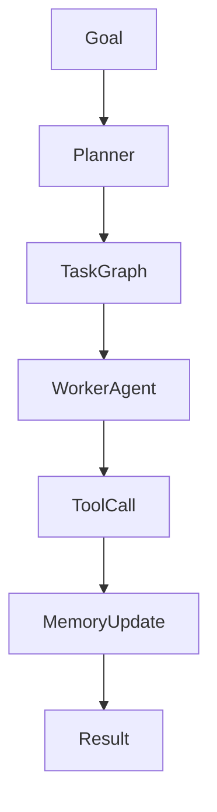
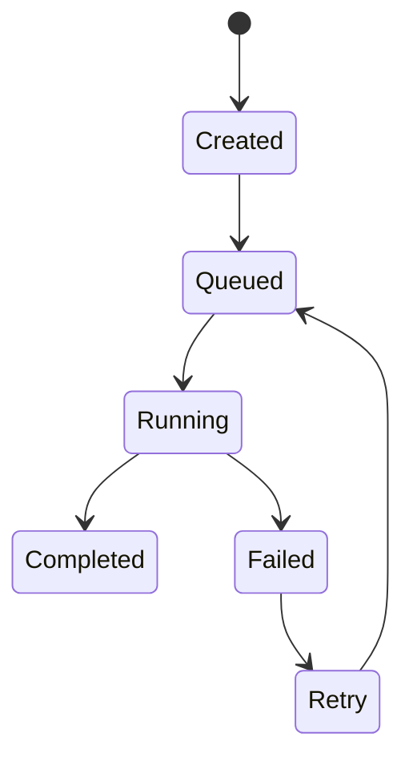
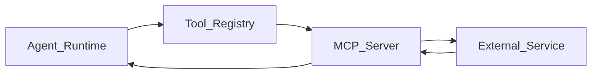
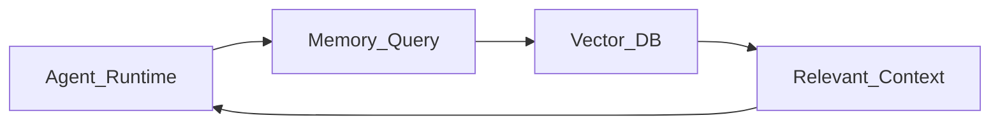
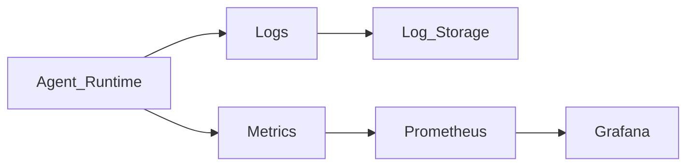
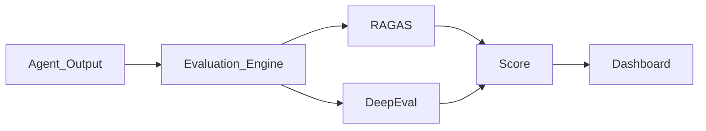

# AgentOS: Development Roadmap

**Version:** 1.0  
**Project:** AgentOS  
**Document Type:** Development Roadmap  
**Status:** Execution Blueprint  

---

## 1. Introduction

The **Development Roadmap** defines the step-by-step implementation strategy for building **AgentOS**.

The goal of the roadmap is to:
- Break the project into manageable phases.
- Define the order of module development.
- Ensure dependencies are implemented correctly.
- Provide a clear execution strategy.

AgentOS will be developed incrementally, beginning with the core runtime infrastructure and gradually expanding into additional platform capabilities.

---

## 2. Development Strategy

The development strategy for AgentOS follows three key principles:

### Infrastructure First
Core runtime infrastructure will be implemented before higher-level services.

### Iterative Development
Features will be implemented in phases to allow testing and validation at each stage.

### Extensibility
Modules will be designed with extensibility in mind so that future features can be integrated easily.

---

## 3. Development Phases

AgentOS development will be divided into several phases:

1. **Phase 1 — Project Initialization**
2. **Phase 2 — Core Runtime**
3. **Phase 3 — Task Orchestration**
4. **Phase 4 — Tool Integration**
5. **Phase 5 — Memory Engine**
6. **Phase 6 — Observability System**
7. **Phase 7 — Evaluation Engine**
8. **Phase 8 — CLI Interface**
9. **Phase 9 — Documentation and Examples**

Each phase builds on the previous phase.

---

## 4. Phase 1 — Project Initialization

This phase prepares the repository and development environment.

**Tasks:**
- Create GitHub repository.
- Initialize Python project.
- Configure project structure.
- Setup dependency management.
- Configure linting and formatting.
- Setup testing framework.
- Setup CI pipeline.

**Recommended Tools:**
- **Language:** Python
- **Dependency Management:** Poetry or uv
- **Testing:** Pytest
- **Linting:** Ruff
- **CI/CD:** GitHub Actions

**Repository Setup Tasks:**
- Create repository structure.
- Add `README.md`.
- Add `LICENSE`.
- Add contribution guidelines.

---

## 5. Phase 2 — Core Runtime

This phase implements the **Agent Runtime**.

**Objectives:**
- Implement agent execution loop.
- Implement reasoning trace logging.
- Integrate LLM interface.

**Key Features:**
- Agent execution engine.
- Task execution interface.
- Runtime configuration.

**Execution Flow:**


**Deliverables:**
- Basic runtime engine.
- Sample agent execution.
- Runtime configuration system.

---

## 6. Phase 3 — Task Orchestration

This phase introduces the **Task Orchestrator**.

**Objectives:**
- Implement task lifecycle.
- Integrate task queue.
- Implement retry logic.

**Task Lifecycle Model:**


**Queue Implementation Options:**
- Redis Queue
- Celery
- Temporal (advanced option)

**Deliverables:**
- Task scheduler.
- Queue integration.
- Task lifecycle tracking.

---

## 7. Phase 4 — Tool Integration

This phase implements the **Tool Layer**.

**Objectives:**
- Create tool registry.
- Integrate MCP protocol.
- Support external APIs.

**Tool Integration Flow:**


**Deliverables:**
- Tool registry.
- MCP integration.
- Example tools.

**Example Tools:**
- GitHub integration.
- Filesystem tools.
- Web search tools.

---

## 8. Phase 5 — Memory Engine

This phase introduces agent memory.

**Objectives:**
- Implement short-term memory.
- Integrate vector database.
- Enable memory retrieval.

**Memory Architecture:**


**Deliverables:**
- Redis-based working memory.
- Vector memory integration.
- Memory retrieval API.

---

## 9. Phase 6 — Observability System

This phase introduces system monitoring.

**Objectives:**
- Implement logging infrastructure.
- Track reasoning traces.
- Monitor system metrics.

**Recommended Stack:**
- OpenTelemetry
- Prometheus
- Grafana

**Observability Flow:**


**Deliverables:**
- Structured logging.
- Metrics dashboard.
- Trace visualization.

---

## 10. Phase 7 — Evaluation Engine

This phase integrates evaluation frameworks.

**Objectives:**
- Evaluate agent outputs.
- Measure response quality.
- Detect hallucinations.

**Integrated Frameworks:**
- RAGAS
- DeepEval

**Evaluation Pipeline:**


**Deliverables:**
- Evaluation pipeline.
- Evaluation reports.

---

## 11. Phase 8 — CLI Interface

This phase builds the developer interface.

**Example Commands:**
```bash
agentos init
agentos register-agent
agentos run-task
agentos list-agents
agentos inspect-task
```

**Deliverables:**
- CLI framework.
- Command handlers.
- Developer documentation.

---

## 12. Phase 9 — Documentation and Examples

This phase prepares the project for open-source release.

**Tasks:**
- Complete documentation.
- Provide example agents.
- Write tutorials.

**Example Agents:**
- Research Agent
- Coding Agent
- Resume Optimization Agent

---

## 13. Roadmap Summary

The **AgentOS** roadmap follows a structured development process:

- **Phase 1:** Initialization
- **Phase 2:** Runtime
- **Phase 3:** Task Orchestration
- **Phase 4:** Tool Integration
- **Phase 5:** Memory Engine
- **Phase 6:** Observability
- **Phase 7:** Evaluation
- **Phase 8:** CLI
- **Phase 9:** Documentation

---

## 14. Expected Outcome

Upon completion of the roadmap, **AgentOS** will provide a complete infrastructure platform capable of:
- Running AI agents.
- Orchestrating tasks.
- Integrating external tools.
- Managing memory.
- Monitoring system behavior.
- Evaluating agent performance.
