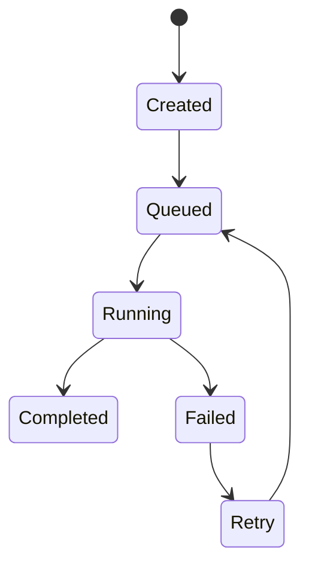
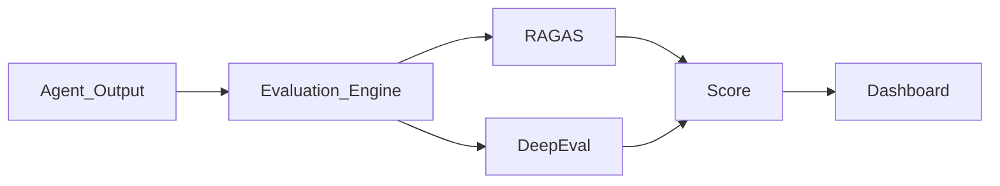
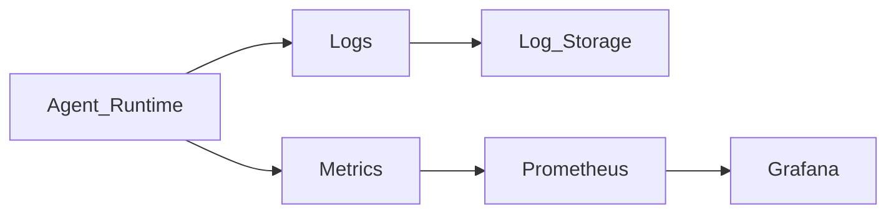

# AgentOS: MVP Definition Document

**Version:** 1.0  
**Project:** AgentOS  
**Document Type:** Minimum Viable Product (MVP) Definition  
**Status:** Development Blueprint  

---

## 1. Introduction

The **MVP Definition** document outlines the scope of the first release of **AgentOS**.

AgentOS is envisioned as a large-scale infrastructure platform for managing AI agents. However, implementing the full vision in the first version would introduce unnecessary complexity. The MVP defines the minimum set of features required to deliver a functional and useful version of AgentOS.

The primary goals of the MVP are:
- Establish the core infrastructure.
- Validate system architecture.
- Enable early developer adoption.
- Provide a foundation for future expansion.

**AgentOS v0.1** will focus on core runtime capabilities rather than advanced ecosystem features.

---

## 2. MVP Philosophy

The MVP is guided by the following principles:

### Build the Core Infrastructure First
AgentOS must first prove that it can reliably manage AI agents before introducing advanced features such as marketplaces or enterprise governance.

### Focus on Developer Experience
The first version should allow developers to easily deploy and manage agents locally.

### Avoid Premature Complexity
Advanced features will be added incrementally after the core system is stable.

---

## 3. MVP Scope

AgentOS v0.1 will include the following core modules:
- **Agent Runtime**
- **Task Orchestrator**
- **Agent Registry**
- **Tool Layer (MCP Integration)**
- **Memory Engine**
- **Evaluation Engine**
- **Observability System**
- **CLI Interface**

These modules together provide the minimal infrastructure required to run and manage agents.

---

## 4. Modules Included in MVP

### 4.1 Agent Runtime
The Agent Runtime is responsible for executing agent workflows.

**Responsibilities:**
- Run agent reasoning loops.
- Coordinate tool usage.
- Manage agent state.
- Record reasoning traces.

**Capabilities:**
- Execute single-agent workflows.
- Support multi-step reasoning.
- Integrate with external tools.

### 4.2 Task Orchestrator
The Task Orchestrator manages the lifecycle of agent tasks.

**Responsibilities:**
- Schedule tasks.
- Manage task state transitions.
- Retry failed tasks.
- Handle task queues.

**Task Lifecycle Model:**


**Queue System Recommendation:**
- Redis-based task queue.

### 4.3 Agent Registry
The Agent Registry stores metadata about agents.

**Responsibilities:**
- Register new agents.
- Manage agent versions.
- Store agent configuration.

**Example Stored Data:**
- Agent ID
- Agent name
- Agent version
- Associated tools
- Execution parameters

**Storage Recommendation:**
- PostgreSQL

### 4.4 Tool Layer (MCP Integration)
The Tool Layer allows agents to interact with external services.

**Responsibilities:**
- Register tools.
- Route tool calls.
- Enforce security boundaries.

**Supported Integrations:**
- Model Context Protocol (MCP) servers.
- REST APIs.
- Internal tools.

**Example Tools:**
- GitHub integration.
- Filesystem access.
- Web search.
- Browser automation.

### 4.5 Memory Engine
The Memory Engine provides memory capabilities for agents. Two types of memory will be supported:

#### Short-Term Memory
- Used during active task execution.
- **Recommended storage:** Redis.

#### Long-Term Memory
- Used for knowledge retrieval.
- **Recommended storage:** Vector database.
- **Suggested options:** Qdrant, Weaviate.

**Capabilities:**
- Vector similarity search.
- Context retrieval.

### 4.6 Evaluation Engine
The Evaluation Engine measures agent performance.

**Responsibilities:**
- Evaluate outputs.
- Detect hallucinations.
- Compute performance metrics.

**Integrated Frameworks:**
- RAGAS
- DeepEval

**Evaluation Pipeline:**


### 4.7 Observability System
The Observability System provides insight into agent behavior.

**Responsibilities:**
- Log reasoning traces.
- Track token usage.
- Monitor task execution.
- Record system metrics.

**Recommended Stack:**
- OpenTelemetry
- Prometheus
- Grafana

**Observability Flow:**


### 4.8 CLI Interface
The CLI allows developers to interact with AgentOS without building a UI. It will act as the primary developer interface for the MVP.

**Example Commands:**
```bash
agentos init
agentos register-agent
agentos run-task
agentos list-agents
agentos inspect-task
```

---

## 5. Features Excluded from MVP

The following features will be implemented in later versions:
- Agent Marketplace
- Visual Workflow Builder
- Enterprise RBAC
- Hosted AgentOS Platform
- Multi-agent collaboration frameworks
- Advanced governance tools

These features are intentionally postponed to maintain focus on core infrastructure.

---

## 6. Development Milestones

The MVP will be implemented through seven development phases:

- **Phase 1 — Core Runtime**: Initialize repository, implement runtime, basic execution.
- **Phase 2 — Task Orchestration**: Task queue implementation, lifecycle management.
- **Phase 3 — Tool Integration**: MCP tool support, tool registry.
- **Phase 4 — Memory Engine**: Redis short-term memory, vector database integration.
- **Phase 5 — Observability**: Logging infrastructure, metrics tracking.
- **Phase 6 — Evaluation Engine**: RAGAS and DeepEval integration.
- **Phase 7 — CLI Interface**: Developer command-line tools.

---

## 7. MVP Success Criteria

The MVP will be considered successful if:
- Developers can register agents.
- Agents can execute tasks reliably.
- Agents can interact with tools.
- System logs reasoning traces.
- System evaluates agent outputs.

These capabilities validate the core infrastructure of AgentOS.

---

## 8. Future Expansion

After the MVP is complete, future versions may introduce:
- Agent marketplace.
- Plugin ecosystem.
- Visual workflow orchestration.
- Enterprise security features.
- Hosted cloud platform.

---

## 9. Summary

The **AgentOS MVP** focuses on delivering the essential infrastructure required to run and manage AI agents. By prioritizing runtime execution, task orchestration, observability, and evaluation, the MVP establishes a strong foundation for the long-term evolution of the platform.
