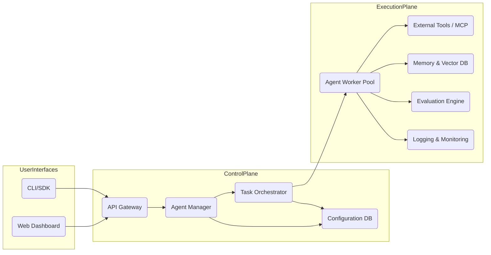
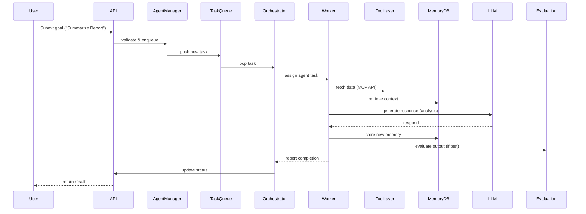
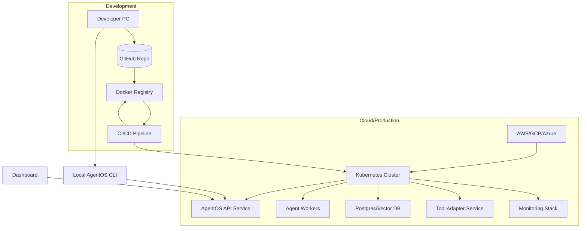
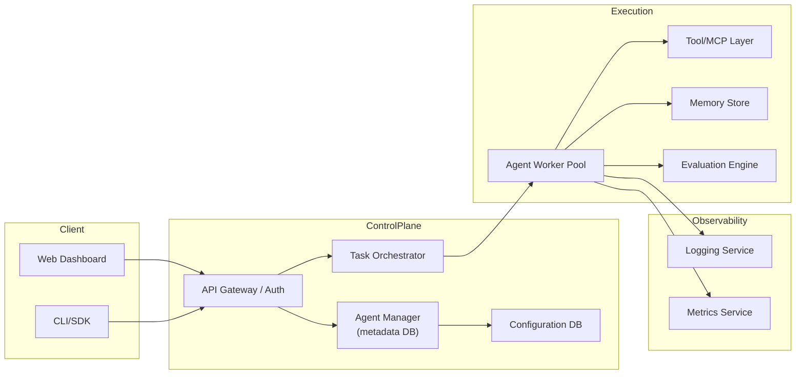

# AgentOS – System Architecture Design

This document defines the **technical architecture** of AgentOS, specifying how the components identified in the ARS/URS/SRS fit together. It includes high-level diagrams (in Mermaid syntax) and descriptions of major modules, data flows, and deployment. Citations highlight real-world parallels and best practices.

## Architecture Overview

AgentOS adopts a **service-oriented architecture** with a clear separation between control plane and execution plane.  

- The **Control Plane** includes the API gateway, Agent Manager, and Task Orchestrator. It handles user requests (via CLI/API/UI), schedules agent tasks, and manages metadata.  
- The **Execution Plane** consists of Agent Runtimes (workers), a Tool/Integration layer (MCP clients, external APIs), Memory storage, and Evaluation/Observability services.  
- This design matches industry examples: PwC describes its Agent OS as a *“central nervous system and switchboard for enterprise AI,” seamlessly connecting agents across platforms*【58†L693-L700】. Similarly, IBM’s AgentOps emphasizes a unified orchestrator for agent lifecycles【36†L150-L158】.

Below is a high-level architecture diagram in Mermaid format:

**Figure:** *High-level AgentOS architecture.* Users (via CLI/SDK or Dashboard) interact with the API Gateway, which connects to the Agent Manager and Task Orchestrator. The Orchestrator dispatches tasks to a pool of Agent Workers. Workers invoke external tools (via MCP), read/write to Memory (vector DB), and feed results into the Evaluation Engine and Monitoring stack.

## Key Components

- **API Gateway:** Exposes REST/WebSocket endpoints and CLI hooks. Authenticates users and forwards requests to the Agent Manager.  
- **Agent Manager:** The central registry of agents (metadata, versions, configurations). It tracks agent definitions and routes user operations.  
- **Task Orchestrator:** Receives user-submitted goals, decomposes them into tasks, and assigns tasks to agent workers. It handles task lifecycles (scheduled, running, paused, completed). This reflects IBM’s AgentOps vision of managing agent pipelines【36†L150-L158】.  
- **Agent Workers (Runtime):** Stateless containers or processes that execute agent logic. Each worker loads an agent’s code or prompt and runs it, calling the tool layer and memory as needed. The workers report status back to the orchestrator.  
- **Tool/Integration Layer (MCP):** A modular tool registry supporting the Model Context Protocol【15†L30-L39】. Agents call this layer to perform actions (web search, database query, etc.). New tools (plugins) can be added without modifying core system.  
- **Memory & Storage:** A persistent database (e.g. SQL + vector database) stores agent memories, conversation context, and system state. This enables resume/recovery and retrieval-augmented generation. Agno’s AgentOS explicitly includes “memory” in its feature set【1†L21-L24】.  
- **Evaluation Engine:** Runs evaluation pipelines. After an agent task, results can be fed into RAGAS/DeepEval modules to score performance. The engine outputs metrics for the UI and logs.  
- **Logging & Monitoring:** Collects logs/traces (all agent decisions, tool calls) and metrics (tokens, latency). A service like Grafana/Prometheus or Langfuse provides real-time dashboards. This satisfies the need for end-to-end observability【36†L165-L173】.  
- **CLI/SDK & Dashboard:** Interfaces for users. The CLI (e.g. `agentos` command) interacts with the API. The Web Dashboard offers visual workflow editing and monitoring (PwC’s design highlights a “drag-and-drop” workflow builder【58†L708-L714】).  

These components run in containers or services. The design is **framework-agnostic**: for example, AG2’s AgentOS stresses universal interoperability of agents across frameworks【16†L68-L76】. AgentOS similarly does not hardcode any specific agent framework.

## Data Flows

Typical data flows in AgentOS include:

1. **User Task Submission:**  
   The user sends a goal via CLI or UI → API Gateway.  
   The API forwards to the Agent Manager/Orchestrator, which creates a new Task record in the database and enqueues it.

2. **Task Scheduling:**  
   The Task Orchestrator dequeues the task and assigns it to an Agent Worker from the pool. It also logs the scheduling event for observability.

3. **Agent Execution:**  
   The Agent Worker loads the agent’s prompt and context from Memory. It generates a reasoning chain (prompt → LLM → action → tool call → memory update).  
   Each reasoning step is sent to the Logging system in real-time. 
   The worker may invoke external tools via the Tool Layer (MCP client) and write results to Memory.

4. **Completion or Pause:**  
   Once the goal is achieved, the worker marks the task complete. If a human checkpoint was configured, the worker pauses and notifies the orchestrator/UI, which waits for approval.

5. **Result Storage:**  
   Final agent outputs are saved (in database or file store) and made available to the user. The Evaluation Engine may kick in to score the results (if test mode was used).

6. **Monitoring & Metrics:**  
   Throughout execution, metrics (tokens used, time per step, errors) are recorded. The Observability component aggregates these for dashboards.

A simplified sequence diagram (in Mermaid syntax) for an agent execution might be:

## Deployment Architecture

AgentOS is designed to be **cloud-agnostic**. All components should be containerized (Docker), with deployment options for local development and production clusters (Kubernetes or Docker Compose). A sample deployment architecture:

**Figure:** *Example deployment flow (top) and architecture (bottom).* Developers push code to GitHub, which triggers CI to build Docker images and deploy to a Kubernetes cluster. The cluster runs AgentOS API, Workers, DBs, and other microservices. Users interact via CLI or Dashboard over the API.

## Mermaid Component Diagram

Below is a more detailed Mermaid component diagram illustrating the main modules and their interactions:

**Figure:** *Component interactions (left to right).*

In this diagram:
- **API Gateway** handles authentication and routes to Manager/Orchestrator.  
- **Agent Manager** uses the Configuration DB to store agent definitions.  
- **Task Orchestrator** schedules tasks to the **Agent Worker Pool**.  
- **Agent Workers** invoke the **Tool Layer**, update **Memory Store**, and call the **Evaluation Engine**.  
- All workers send logs to the Logging service and metrics to Prometheus/Grafana (or similar).

## Open-Source Release and Deployment Best Practices

For deployment and release:

- **Containerization:** Provide official Docker images. Support one-command local startup (Docker Compose) and Helm charts for Kubernetes. This aligns with modern service deployment practices.  
- **Cloud Agnostic:** As noted by PwC, ensure the platform can run on any major cloud or on-premises without code changes【58†L708-L714】.  
- **License & Documentation:** Use an OSI-approved license (MIT or Apache-2.0)【61†L420-L423】【20†L147-L156】. Include a `LICENSE` file and follow GitHub best practices: README, contribution guidelines, and code of conduct【61†L420-L423】.  
- **Release Process:** Tag versions and provide releases on GitHub. Automate CI/CD pipelines to build/test the code. Create a `HISTORY.md` or changelog.  
- **Community Guidelines:** Encourage contributions by maintaining an issue tracker, PR templates, and clear contribution docs.  

Following these practices (outlined in open-source guides【61†L420-L423】【20†L147-L156】) will make AgentOS robust, maintainable, and easy for others to adopt.

